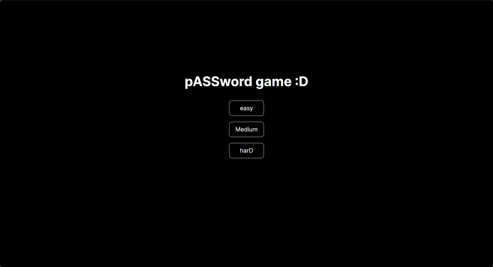
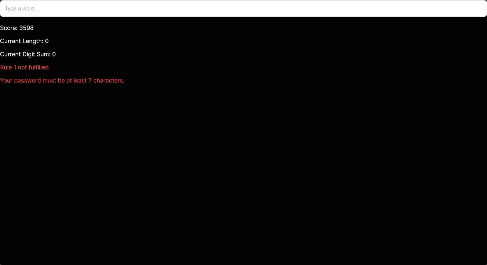
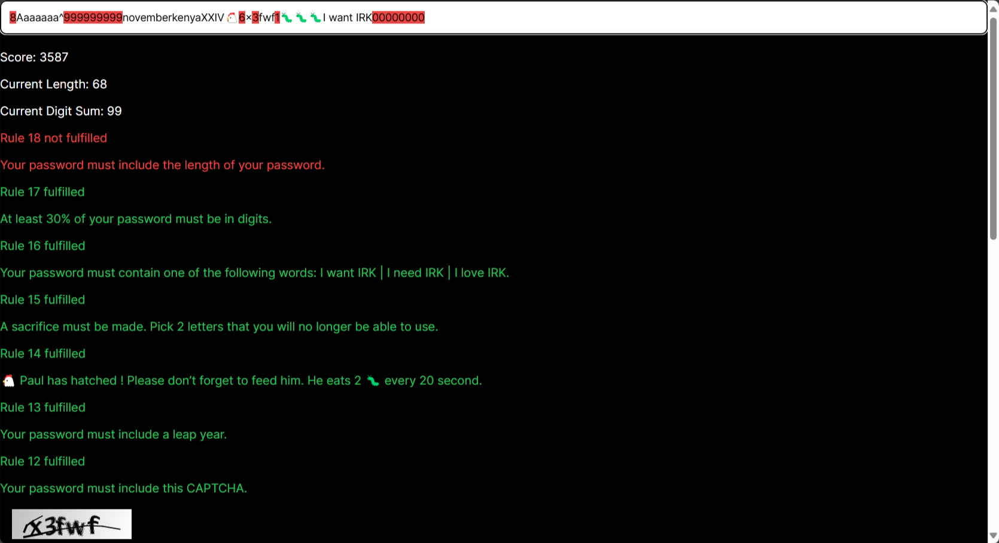
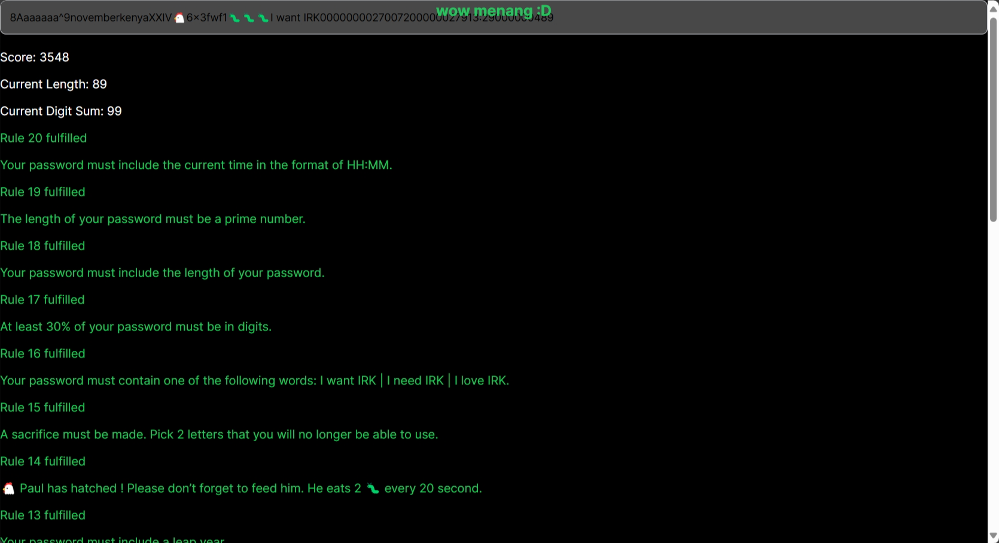
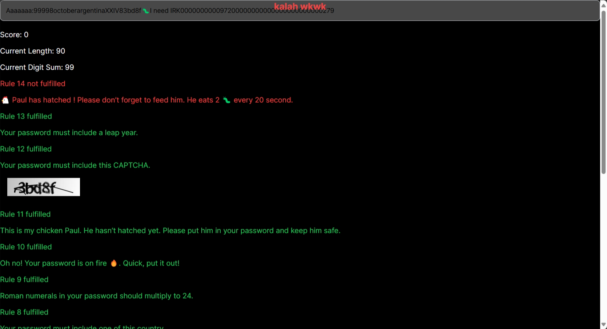

# The Password Game - Soal 1 Seleksi Laboratorium IRK

## Daftar Isi

- [Deskripsi Aplikasi](#deskripsi-aplikasi)
- [Teknologi yang Digunakan](#teknologi-yang-digunakan)
- [Struktur Program](#struktur-program)
- [Penjelasan dan Penggunaan Algoritma](#penjelasan-dan-penggunaan-algoritma)
- [Cara Menjalankan Program](#cara-menjalankan-program)
- [Tangkapan Layar](#tangkapan-layar)
- [Referensi](#referensi)

## Deskripsi Aplikasi

The Password Game adalah permainan puzzle berbasis web. Pemain ditugaskan untuk mengetikkan kata sandi di sebuah kotak input seperti memasukkan kata sandi biasa. Permainan ini memiliki total 20 aturan kata sandi yang harus diikuti. Saat pemain mengubah kata sandi untuk mematuhi aturan pertama, aturan kedua akan muncul, dan seterusnya. Pemain harus mengikuti semua aturan sebelumnya untuk maju, yang dapat menyebabkan konflik. Ketika semua 20 aturan dipenuhi, pemain akan memenangkan permainan.

## Teknologi yang Digunakan

- Node.js 18.17
- Tailwind CSS
- SQLite3
- TypeScript
- Docker

## Struktur Program

```
.
├── app
│   ├── easy
│   │   └── page.tsx
│   ├── favicon.ico
│   ├── globals.css
│   ├── hard
│   │   └── page.tsx
│   ├── layout.tsx
│   ├── medium
│   │   └── page.tsx
│   └── page.tsx
├── database.db
├── lib
│   └── db.ts
├── next.config.mjs
├── next-env.d.ts
├── package.json
├── package-lock.json
├── pages
│   └── api
│       ├── captcha.ts
│       └── country.ts
├── postcss.config.mjs
├── public
│   ├── next.svg
│   └── vercel.svg
├── README.md
├── tailwind.config.ts
└── tsconfig.json
```

## Penjelasan dan Penggunaan Algoritma

Algoritma yang paling utama dari program ini adalah penggunaan **Regular Expression** untuk melakukan pencocokan string. Alasan pengembang untuk menggunakan algoritma ini adalah karena algoritma pencocokan string ini paling sederhana jika dibandingkan dengan algoritma pencocokan string lain seperti Knuth–Morris–Pratt dan Boyer–Moore.  
Maksudnya sederhana bagaimana? Jika dilihat, KMP dan BM membutuhkan fungsi pembantu untuk melakukan pencocokan dua string, yaitu *Border Function* dan *Last Occurrence Function*. Sedangkan jika kita menggunakan Regular Expression, kita tidak membutuhkan fungsi apa-apa. Kita hanya perlu membuat pattern dari string yang akan kita cocokkan sehingga proses pencocokan juga akan semakin cepat.

## Cara Menjalankan Program

1. Install Node.js dari [sini](https://nodejs.org/)

1. Clone repositori ini dan lakukan navigasi ke direktori utama dari repositori
    ``` bash
    git clone https://github.com/Nerggg/password-game
    cd password-game
    ```

1. Install semua package yang digunakan dalam program
    ``` bash
    npm install
    ```

1. Jalankan program
    ``` bash
    npm run dev
    ```

Atau jika ingin menggunakan Docker, cukup jalankan program dengan perintah berikut
``` bash
docker compose up
```

## Tangkapan Layar







## Referensi

- https://neal.fun/password-game/
- https://informatika.stei.itb.ac.id/~rinaldi.munir/Stmik/2020-2021/Pencocokan-string-2021.pdf
- https://stackoverflow.com/questions/3225037/regular-expression-vs-kmp